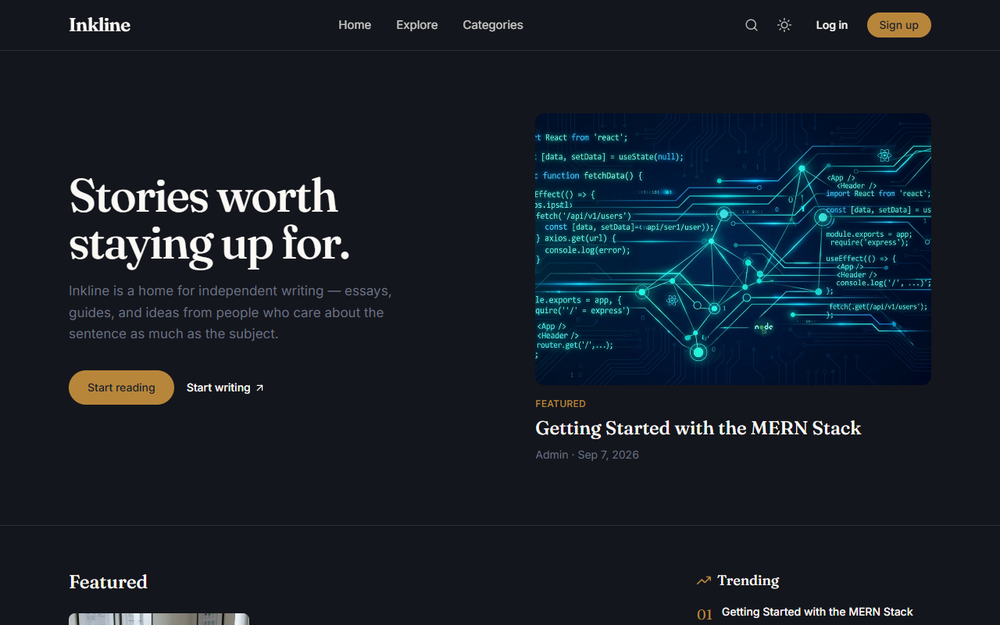
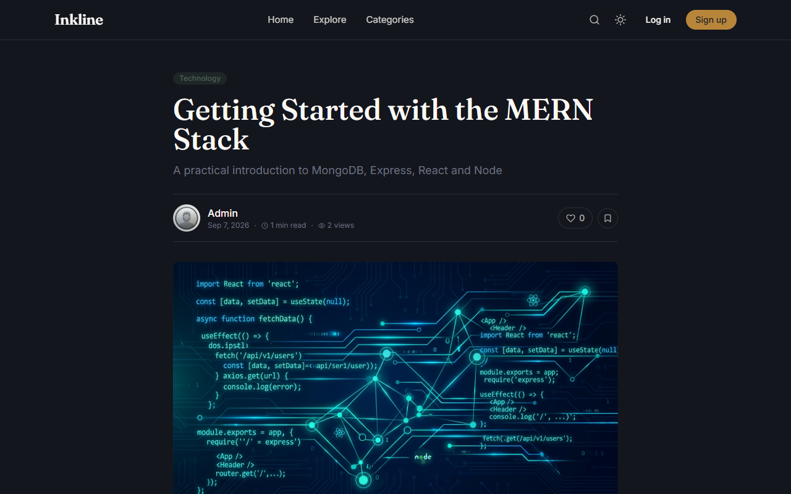

# Inkline — A MERN Blog Platform with Comments

Inkline is a full-stack blog platform built on the MERN stack (MongoDB, Express,
React, Node.js). Writers can publish rich-text posts with cover images,
readers can comment, reply, like, and bookmark, and admins get a full
moderation dashboard.

> Rename freely — "Inkline" is just the working name used throughout the UI
> and copy. Search for it in `client/index.html`, `client/src/components/Navbar.jsx`,
> and `client/src/components/HeroBanner.jsx` if you want to swap it out.

---

## Table of Contents

- [Features](#features)
- [Tech Stack](#tech-stack)
- [Folder Structure](#folder-structure)
- [Screenshots](#screenshots)
- [Getting Started](#getting-started)
- [Environment Variables](#environment-variables)
- [Seeding the Database](#seeding-the-database)
- [API Documentation](#api-documentation)
- [Deployment Guide](#deployment-guide)
- [Security Notes](#security-notes)
- [Known Limitations](#known-limitations)
- [License](#license)

---

## Features

**Authentication & Authorization**
- Register / login / logout with JWT (httpOnly cookie + bearer token)
- Passwords hashed with bcrypt
- Forgot / reset password via email (Nodemailer)
- Role-based access control (`user`, `admin`) and protected routes

**Blog Posts**
- Rich-text editor (React Quill) with cover image upload (Cloudinary)
- Draft / published / pending workflow
- Auto-generated slug, excerpt, and estimated read time
- View counter, like counter, tags, categories
- Search by title/author/tag/category, sort by latest/oldest/most viewed/most liked
- Pagination, related posts, featured posts, trending posts (14-day view+like score)

**Comments**
- Add / edit / delete own comments, one level of threaded replies
- Like comments
- Admin: flag/unflag as spam, delete any comment

**Users**
- Profile with avatar, bio, social links
- My posts, saved (bookmarked) posts, liked posts
- Public author pages

**Admin Dashboard**
- Stats: total users, posts, comments, categories, views
- Manage users (promote/demote, activate/deactivate, delete)
- Manage posts (approve/draft, delete)
- Moderate comments (flag spam, delete)
- Manage categories (create/edit/delete)

**Other**
- Newsletter signup
- Dark/light theme (persisted)
- Toast notifications, loading states, custom 404
- Helmet, CORS, rate limiting, input validation, mongo-sanitize

**Performance**
- Route-level code splitting via `React.lazy` + `Suspense` (each page is its own chunk)
- Infinite scroll on the home feed, traditional pagination on search/explore
- Lazy-loaded images (`loading="lazy"`) and Cloudinary auto-format/quality transforms
- Lightweight in-memory API response caching on read-heavy public endpoints

---

## Tech Stack

| Layer | Technology |
|---|---|
| Frontend | React 18 (Vite), Tailwind CSS, React Router, Context API |
| Rich text | React Quill |
| Animations | Framer Motion |
| HTTP | Axios |
| Icons / Toasts | React Icons, React Toastify |
| Backend | Node.js, Express.js |
| Database | MongoDB Atlas + Mongoose |
| Auth | JWT + bcrypt |
| Image storage | Cloudinary (via Multer) |
| Deployment | Vercel (frontend), Render (backend), MongoDB Atlas (database) |

---

## Folder Structure

```
blog-platform/
├── client/                  # React + Vite frontend
│   ├── src/
│   │   ├── components/      # Reusable UI components
│   │   ├── pages/           # Route-level views
│   │   ├── context/         # AuthContext, ThemeContext
│   │   ├── services/        # Axios API wrappers (one per resource)
│   │   ├── hooks/           # useAuth, useTheme, useDebounce
│   │   ├── utils/           # formatting helpers
│   │   ├── App.jsx          # Route definitions
│   │   └── main.jsx         # Entry point / providers
│   ├── index.html
│   ├── tailwind.config.js
│   ├── vite.config.js
│   └── vercel.json
├── server/                  # Express backend
│   ├── config/              # db.js, cloudinary.js
│   ├── models/              # User, BlogPost, Comment, Category, Tag, Newsletter
│   ├── controllers/         # Route handlers
│   ├── routes/               # Express routers
│   ├── middleware/           # auth, error handling, upload, rate limiting, validation
│   ├── utils/                # email, API features (search/filter/sort/paginate), seed script
│   └── server.js             # Express app entry point
├── render.yaml               # Render deployment blueprint (optional)
├── package.json               # Root workspace scripts
└── README.md
```

---

## Screenshots

| Home Page | Post Detail | Admin Dashboard |
|---|---|---|
|  |  |  |

---

## Getting Started

### Prerequisites
- Node.js 18+
- A [MongoDB Atlas](https://www.mongodb.com/cloud/atlas) cluster (or local MongoDB)
- A [Cloudinary](https://cloudinary.com) account (free tier is fine)
- An SMTP provider for password-reset emails (Gmail app password, Mailtrap, SendGrid, etc.)

### 1. Clone and install

This project uses **npm workspaces**, so a single install at the root
installs both `client` and `server` dependencies.

```bash
git clone <your-repo-url> blog-platform
cd blog-platform
npm install
```

### 2. Configure environment variables

```bash
cp server/.env.example server/.env
cp client/.env.example client/.env
```

Fill in `server/.env` with your MongoDB URI, JWT secret, Cloudinary keys, and
SMTP credentials (see [Environment Variables](#environment-variables) below).
`client/.env` only needs `VITE_API_URL` (defaults to `http://localhost:5000/api`).

### 3. Run both apps together

```bash
npm run dev
```

This runs the Express API on `http://localhost:5000` and the Vite dev server
on `http://localhost:5173` concurrently. Or run them separately:

```bash
npm run server   # backend only
npm run client   # frontend only
```

### 4. (Optional) Seed sample data

```bash
npm run seed
```

Creates an admin account (`admin@blogplatform.com` / `Admin@12345`), a handful
of categories, and two sample posts. **Change this password immediately in any
shared or deployed environment.**

---

## Environment Variables

### `server/.env`

| Variable | Description |
|---|---|
| `NODE_ENV` | `development` or `production` |
| `PORT` | API port (default `5000`) |
| `CLIENT_URL` | Frontend origin, used for CORS and password-reset links |
| `MONGO_URI` | MongoDB Atlas connection string |
| `JWT_SECRET` | Long random string used to sign JWTs |
| `JWT_EXPIRE` | Token lifetime, e.g. `7d` |
| `JWT_COOKIE_EXPIRE` | Cookie lifetime in days |
| `CLOUDINARY_CLOUD_NAME` / `CLOUDINARY_API_KEY` / `CLOUDINARY_API_SECRET` | From your Cloudinary dashboard |
| `SMTP_HOST` / `SMTP_PORT` / `SMTP_USER` / `SMTP_PASS` | SMTP credentials for Nodemailer |
| `FROM_EMAIL` / `FROM_NAME` | Sender identity for transactional email |
| `RATE_LIMIT_WINDOW_MIN` / `RATE_LIMIT_MAX` | General API rate limiting |

### `client/.env`

| Variable | Description |
|---|---|
| `VITE_API_URL` | Base URL of the deployed/local API, e.g. `http://localhost:5000/api` |

Full templates are in [`server/.env.example`](./server/.env.example) and
[`client/.env.example`](./client/.env.example).

---

## Seeding the Database

`npm run seed` (from the root, or `npm run seed -w server`) runs
[`server/utils/seed.js`](./server/utils/seed.js). It's idempotent — safe to
run more than once — and will not duplicate categories or the admin account
on subsequent runs.

---

## API Documentation

Base URL: `/api`. Protected routes require `Authorization: Bearer <token>`
(or the `token` httpOnly cookie set on login). Admin routes additionally
require `role: admin`.

### Auth
| Method | Endpoint | Access | Description |
|---|---|---|---|
| POST | `/auth/register` | Public | Create an account |
| POST | `/auth/login` | Public | Log in |
| POST | `/auth/logout` | Private | Clear session cookie |
| GET | `/auth/me` | Private | Get current user |
| POST | `/auth/forgot-password` | Public | Send password reset email |
| PUT | `/auth/reset-password/:resetToken` | Public | Reset password with emailed token |

### Posts
| Method | Endpoint | Access | Description |
|---|---|---|---|
| GET | `/posts` | Public | List posts — supports `search`, `category`, `tag`, `author`, `sort`, `page`, `limit` |
| GET | `/posts/:id` | Public | Get one post by id or slug (increments views) |
| POST | `/posts` | Private | Create a post |
| PUT | `/posts/:id` | Private (owner/admin) | Update a post |
| DELETE | `/posts/:id` | Private (owner/admin) | Delete a post |
| PUT | `/posts/:id/like` | Private | Toggle like |
| PUT | `/posts/:id/save` | Private | Toggle bookmark |
| GET | `/posts/:id/related` | Public | Related posts by category/tags |
| GET | `/posts/meta/featured` | Public | Featured posts |
| GET | `/posts/meta/trending` | Public | Trending posts (last 14 days) |

### Comments
| Method | Endpoint | Access | Description |
|---|---|---|---|
| GET | `/comments/:postId` | Public | Threaded comments for a post |
| POST | `/comments` | Private | Add a comment or reply (`{ postId, content, parentComment? }`) |
| PUT | `/comments/:id` | Private (owner) | Edit own comment |
| DELETE | `/comments/:id` | Private (owner/admin) | Delete a comment |
| PUT | `/comments/:id/like` | Private | Toggle like |
| PUT | `/comments/:id/spam` | Private/Admin | Toggle spam flag |

### Users
| Method | Endpoint | Access | Description |
|---|---|---|---|
| GET | `/users/profile` | Private | Get own profile |
| PUT | `/users/profile` | Private | Update own profile |
| PUT | `/users/change-password` | Private | Change password |
| GET | `/users/my-posts` | Private | Own posts (any status) |
| GET | `/users/saved-posts` | Private | Bookmarked posts |
| GET | `/users/liked-posts` | Private | Liked posts |
| GET | `/users/:id` | Public | Public author profile + published posts |

### Categories & Tags
| Method | Endpoint | Access | Description |
|---|---|---|---|
| GET | `/categories` | Public | List categories with post counts |
| POST | `/categories` | Private/Admin | Create category |
| PUT | `/categories/:id` | Private/Admin | Update category |
| DELETE | `/categories/:id` | Private/Admin | Delete category (blocked if posts reference it) |
| GET | `/tags/popular` | Public | Popular tags by post count |

### Admin
| Method | Endpoint | Access | Description |
|---|---|---|---|
| GET | `/admin/stats` | Private/Admin | Dashboard totals + recent activity |
| GET | `/admin/users` | Private/Admin | List/search users |
| PUT | `/admin/users/:id` | Private/Admin | Update role / active status |
| DELETE | `/admin/users/:id` | Private/Admin | Delete a user |
| GET | `/admin/posts` | Private/Admin | List posts of any status |
| PUT | `/admin/posts/:id/status` | Private/Admin | Approve / draft a post |
| GET | `/admin/comments` | Private/Admin | List/moderate comments |

### Uploads & Newsletter
| Method | Endpoint | Access | Description |
|---|---|---|---|
| POST | `/upload` | Private | Upload an image to Cloudinary (`multipart/form-data`, field `image`) |
| DELETE | `/upload/:publicId` | Private | Delete an uploaded image |
| POST | `/newsletter/subscribe` | Public | Subscribe an email address |

---

## Deployment Guide

### 1. MongoDB Atlas
1. Create a free cluster at [mongodb.com/cloud/atlas](https://www.mongodb.com/cloud/atlas).
2. Add a database user and allow network access from `0.0.0.0/0` (or Render's IPs).
3. Copy the connection string into `MONGO_URI`.

### 2. Backend → Render
1. Push this repo to GitHub.
2. In Render, choose **New → Blueprint** and point it at your repo — it will
   read [`render.yaml`](./render.yaml) and provision the service automatically.
   (Alternatively, create a **Web Service** manually: root directory `server`,
   build command `npm install`, start command `npm start`.)
3. Fill in the environment variables marked `sync: false` in the Render
   dashboard (Mongo URI, Cloudinary keys, SMTP credentials, `CLIENT_URL`).
4. Once deployed, note the Render URL (e.g. `https://blog-platform-server.onrender.com`).

### 3. Frontend → Vercel
1. Import the repo into Vercel.
2. Set the **root directory** to `client`.
3. Framework preset: Vite. Build command `npm run build`, output `dist`.
4. Add environment variable `VITE_API_URL` = `https://<your-render-url>/api`.
5. Deploy. `client/vercel.json` already handles SPA routing rewrites.

### 4. Final step
Update `CLIENT_URL` in your Render environment variables to your live Vercel
URL (needed for CORS and password-reset email links), then redeploy the
backend.

---

## Security Notes

- Passwords are hashed with bcrypt (never stored or logged in plain text).
- JWTs are short-lived and can be sent via header or httpOnly cookie.
- `helmet`, `cors`, `express-rate-limit`, `express-mongo-sanitize`, and
  `express-validator` are all applied at the API layer.
- Never commit `.env` files — both are already git-ignored.
- Rotate `JWT_SECRET` and database credentials before using this in production.

## Known Limitations

This is a complete, working reference implementation, not an exhaustive
enterprise product. A few features are intentionally simple and worth
hardening before a real production launch:
- Comment threading is two levels deep (top-level + replies), not infinite nesting.
- API caching is a simple in-memory TTL cache (see `server/middleware/cache.js`),
  scoped to user-independent public endpoints (categories, popular tags,
  featured/trending posts). It's cleared on relevant writes but isn't shared
  across multiple server instances — swap in Redis if you scale horizontally.
- Newsletter subscription only stores emails; it doesn't send campaigns.
- Image optimization relies on Cloudinary's on-the-fly transforms rather than a
  custom pipeline.

## License

MIT — see [LICENSE](./LICENSE).
